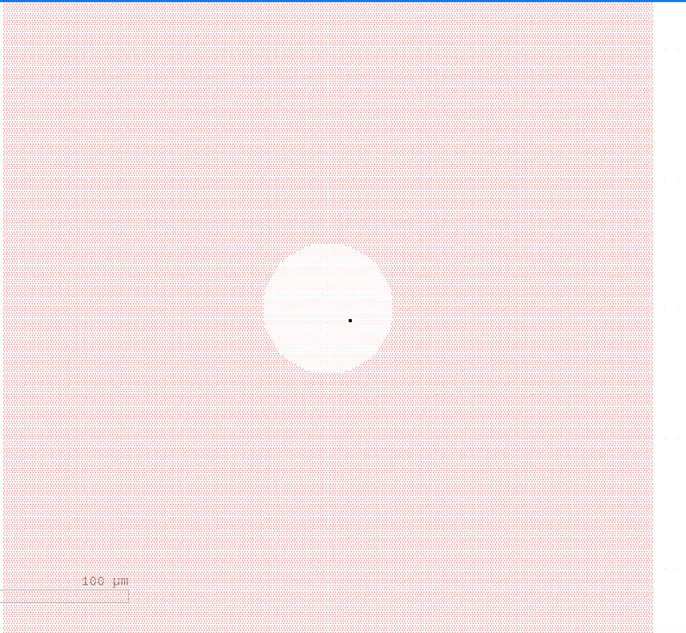
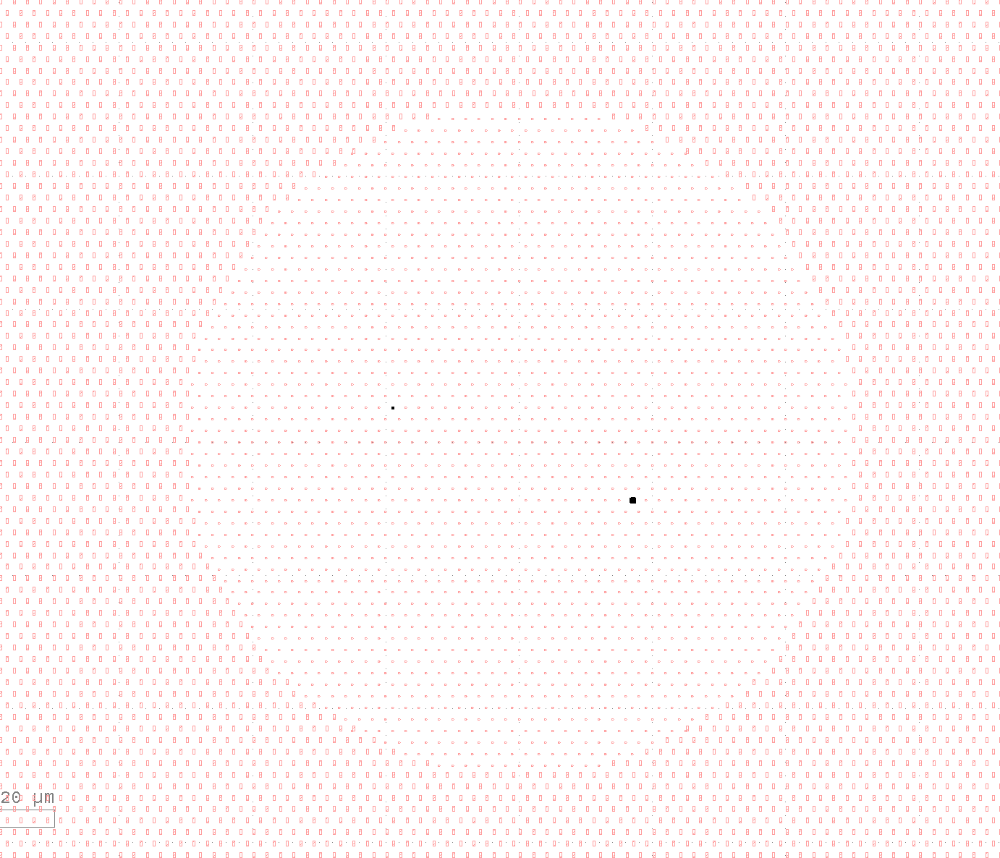

# patternWriter

patternWriter places gdspy shapes on layouts through points or creates layouts with gdspy shapes based on vectors.

## Installation

Download the package or clone the repository, and then install with:

```bash
python setup.py install
```

### Prerequisites

patternWriter uses gdspy


### API Reference

**array_singleReference(X_list, Y_list, reference_geometry)**

Places the reference_geometry at each (x,y) coordinate.

Parameters: 

    X_list (list): List of x coordinates

    Y_list (list): List of y coordinates

    reference_geometry (gdspy cell): a gdspy geometry reference cell

Returns:

    array: an array of the geometry referenced at each (x,y) coordinate

**array_diffGeometries(X_list, Y_list, reference_geometries)**

Places the reference_geometries in order at each (x,y) coordinate.

Parameters: 

    X_list (list): List of x coordinates

    Y_list (list): List of y coordinates

    reference_geometries (list): a list of length X-list length times Y-list lenght of gdspy geometry reference cells

Returns:

    array: an array of the specific geometry referenced at each (x,y) coordinate

**poArrayGen(a,b,dim, generator_function, placement_function, pos=(0,0), arr=[])**

### Basic Usage

This demo creates a hexagonal layout with circles at a distance less than 25 and rectangles at all further points with the dimension 250 by 250.

```python
import gdspy
import numpy as np
import math
import pattern_writer as pw

baseUnit = 1 #layout scale(microns)
m=baseUnit*1e6 
nm = m*1E-9

gdspy.current_library = gdspy.GdsLibrary()
geometry1 = gdspy.Cell("CIRCLE")
geometry1.add(gdspy.Round((0, 0), 72*nm, tolerance=0.001))

geometry2 = gdspy.Cell("RECTANGLE")
geometry2.add(gdspy.Rectangle((0, 0), (200*nm, 400*nm)))

def p_f(point):
    return np.sqrt(point[0]**2 + point[1]**2)
def g_f(distance):
    if distance < 25:
        return geometry1
    else:
        return geometry2
    
a=[1,0]
b=[.5,math.sqrt(3)/2]
dim=(250, 250)
cells=pw.posArrayGen(a,b,dim, g_f, p_f)

gdspy.current_library = gdspy.GdsLibrary()

Lens = gdspy.Cell("LENS")
Lens.add(cells)
gdspy.current_library.add(Lens)
gdspy.write_gds('Testing47.gds')
```
The output layout can be seen in the figures below: 



A zoomed in image of the layout showing the different geometries:



For more details on using gdspy on this see the gdspy documentation: https://github.com/heitzmann/gdspy

The code example shown above can be found as a Jupyter notebook in the Demos folder.

## Authors

Mmeyers3, Trezitorul, Shalm

## License

This project is licensed under the MIT License